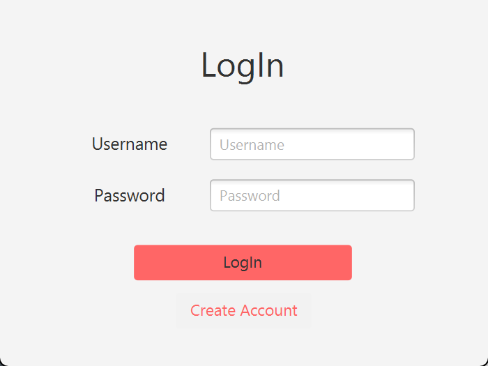
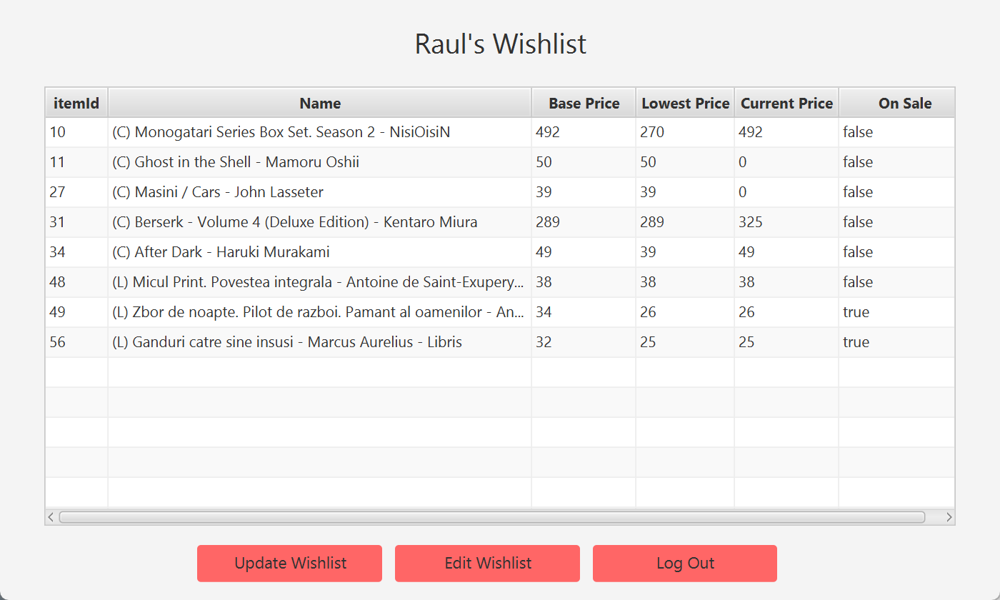
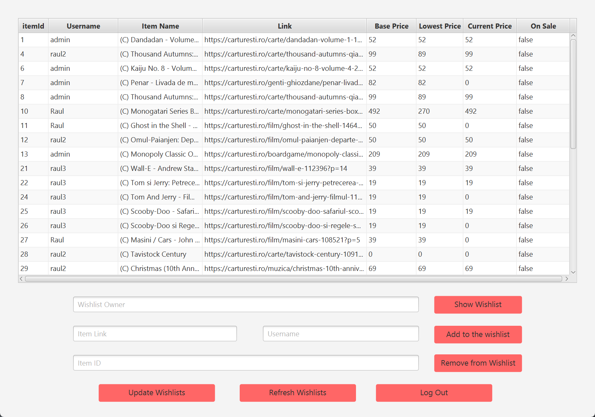

# The Ultimate Carturești (and Libris) Wishlist
A Web-Scraper based wishlist application that scans for the best deals on carturesti.ro (*now libris.ro as well!*) and stores price history for items (made using Java and Html Unit)

# Screenshots: 

## -Login and Create account-

  

## -User Wishlist-

 
Clicking on the update wishlist button will fetch data on all products in the user's wishlist from the carturesti.ro/libris.ro website and update their price/avalability, as well as showing any price differences if the items are on sale.

## -Edit Wishlist-

 
Upon adding a valid item from the carturesti.ro/libris.ro website in the wishlist, the price and avalability of that product will be updated and stored in the user's account.

## -Admin Menu-

 
An admin menu showing all users' wishlists. It has full edit functionallity for all accounts as well as the ability to only show a single user's wishlist.
 
